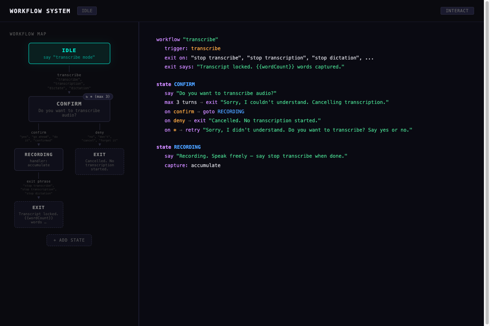
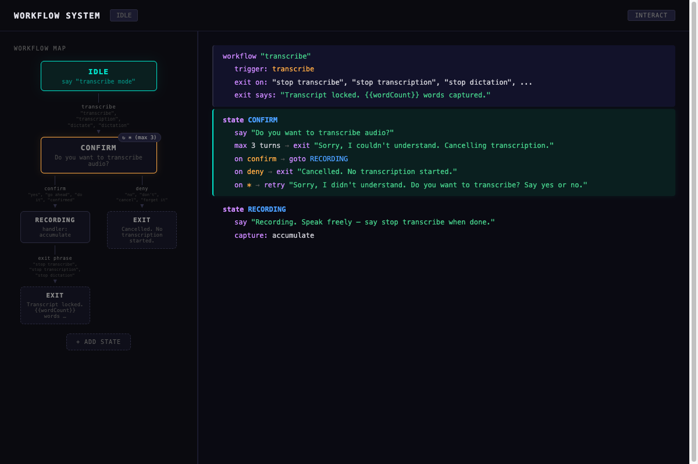
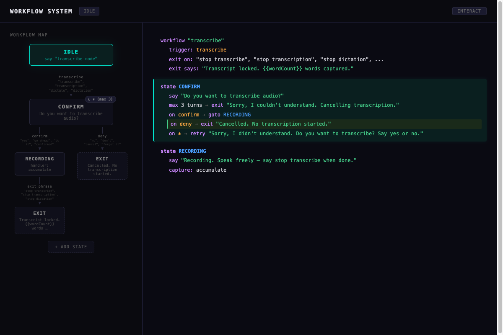
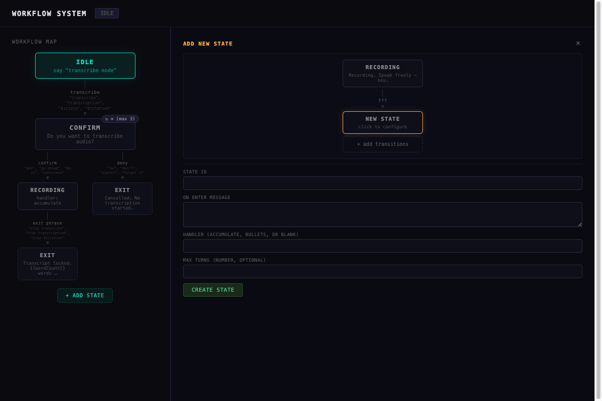
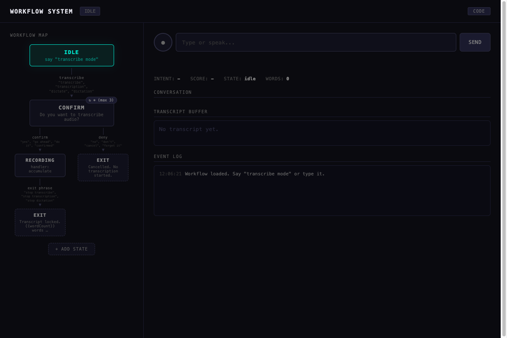
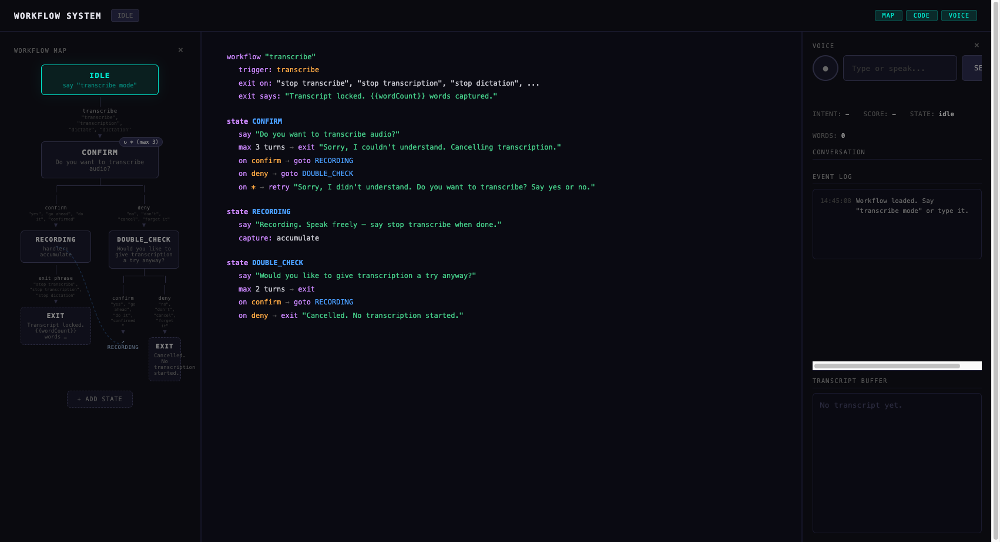
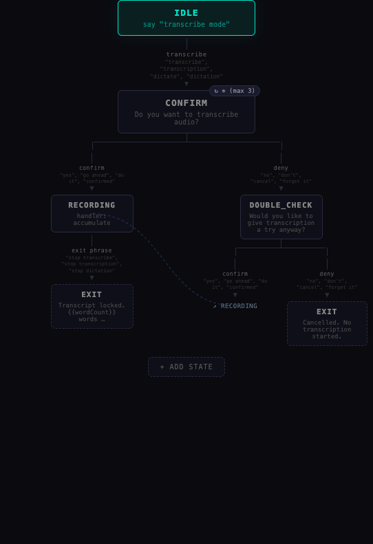

# Speaker Workflow System

A visual editor and runtime engine for declarative, multi-turn conversational workflows. Define flows in JSONL — the editor renders them as interactive graphs with linked pseudocode.

## Quick Start

```bash
npm install
npm run dev
```

Open the URL shown (default [http://localhost:5174](http://localhost:5174)).

## What It Does

The workflow system powers **stateful multi-turn conversations** — sequences where the system guides the user through steps, remembers context across turns, and exits cleanly. The first workflow is a **transcribe mode**: trigger → confirm → capture speech → exit with transcript.

The visual editor lets you:
- See the entire flow as an interactive graph (left) and color-coded pseudocode (right)
- **Graph-aware rendering** — shared states appear once with `↗` link targets and dotted SVG connectors instead of duplicated subtrees
- **Tree connector lines** — branch arms stay visually connected at any panel width
- Click any node or arrow to highlight the matching code
- Edit states, transitions, messages, and keywords inline
- Add new states via a visual preview graph
- Rename state IDs with automatic re-wiring of all transitions
- Test the workflow interactively via the INTERACT panel

## Screenshots

| Code View (default) | Highlight State | Highlight Arrow |
|:---:|:---:|:---:|
|  |  |  |

| Add State Editor | Interact Mode |
|:---:|:---:|
|  |  |

| Graph-Aware Map | Tree Connectors (wide) |
|:---:|:---:|
|  |  |

## Project Structure

```
├── src/
│   ├── workflow.ts          # Engine — state machine, handlers, template resolution
│   ├── workflowHandlers.ts  # Named handlers (accumulate, bullets)
│   ├── intentClassifier.ts  # Keyword-based intent classification
│   ├── workflowMap.ts       # Graph-aware workflow map with link nodes + SVG connectors
│   ├── stateHighlight.ts    # Runtime state highlighting (active, visited, exit)
│   ├── demo.ts              # UI — editors, interaction panel, layout
│   ├── codeView.ts          # Pseudocode generator with bidirectional highlighting
│   └── editorUtils.ts       # Parse/serialize helpers for editors
├── data/
│   └── workflows.jsonl      # Workflow definitions (one JSON object per line)
├── tests/
│   ├── workflow.test.ts     # Engine tests (72 passing)
│   ├── transcribe.test.ts   # Transcribe workflow integration tests
│   └── editor.test.ts       # Editor parse/serialize tests
├── index.html               # Entry point + all CSS
├── DESIGN.md                # Architecture and JSONL format specification
├── CLAUDE.md                # Instructions for Claude Code
└── docs/decisions/          # Architecture Decision Records (ADRs)
    ├── 000-INDEX.md         # Searchable index with tags
    ├── 001–011              # 11 decisions covering engine, UI, data format
```

## Commands

```bash
npm run dev          # Dev server (Vite)
npm run test         # Run all tests (Vitest)
npm run test:watch   # Watch mode
```

## JSONL Config Format

Each workflow is a single JSON object per line in `data/workflows.jsonl`:

```jsonc
{
  "id": "transcribe",
  "triggerIntent": "transcribe",
  "initialState": "confirm",
  "exitPhrases": ["stop transcribe", "stop transcription", "stop dictation"],
  "exitMessage": "Transcript locked. {{wordCount}} words captured.",
  "states": {
    "confirm": {
      "id": "confirm",
      "onEnter": "Do you want to transcribe audio?",
      "transitions": {
        "confirm": "recording",
        "deny": "exit:Cancelled. No transcription started.",
        "*": "confirm:Sorry, I didn't understand. Say yes or no."
      },
      "maxTurns": 3,
      "maxTurnsTarget": "exit:Sorry, I couldn't understand."
    },
    "recording": {
      "id": "recording",
      "onEnter": "Recording. Speak freely — say stop transcribe when done.",
      "handler": "accumulate",
      "transitions": {}
    }
  }
}
```

## Key Concepts

- **States** — each state has an `onEnter` message, optional `handler`, and `transitions`
- **Transitions** — `intent → target` where target is a state ID, `exit`, or `stateId:message` (for retry with message)
- **Handlers** — `accumulate` appends input to a buffer, `bullets` formats as a list
- **Template variables** — `{{wordCount}}`, `{{buffer}}`, `{{turnCount}}` in exit/enter messages
- **Exit phrases** — global phrases that exit the workflow from any state

## Architecture Decisions

All significant design choices are documented as [Architecture Decision Records](docs/decisions/000-INDEX.md). Searchable by tags like `[engine]`, `[ui]`, `[data-format]`, `[readability]`. Key decisions:

- [ADR-001](docs/decisions/001-jsonl-workflow-format.md) — Why JSONL for workflow definitions
- [ADR-002](docs/decisions/002-declarative-state-machine.md) — Declarative state machine over hand-coded FSMs
- [ADR-006](docs/decisions/006-linked-pseudocode-view.md) — Linked pseudocode view over raw JSON or builder DSL
- [ADR-010](docs/decisions/010-bidirectional-graph-code-highlighting.md) — Bidirectional graph ↔ code highlighting
- [ADR-011](docs/decisions/011-graph-aware-workflow-map.md) — Graph-aware map with link nodes and tree connectors

## Tech Stack

- [Vite](https://vitejs.dev/) + TypeScript (vanilla, no framework)
- [Vitest](https://vitest.dev/) for testing
- No runtime dependencies — pure DOM manipulation

## License

MIT
